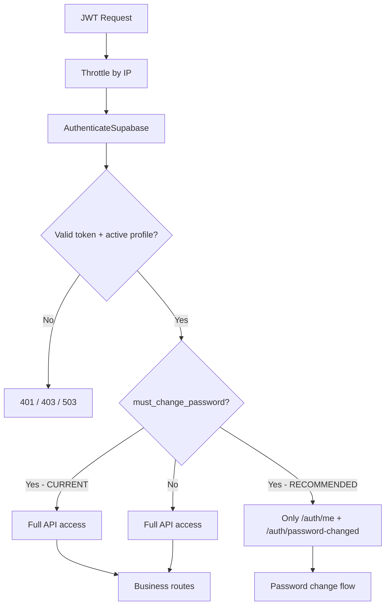

# SOC 5 Outbound — Fix Recommendations & Audit Report

**Generated:** 2026-06-29  
**Scope:** Full-stack audit (frontend, backend, Docker, CI/CD, Supabase migrations, deployment)  
**Production URL:** https://soc5outboundops.app

---

## Executive Summary

The project builds and deploys successfully today, but several **security gaps**, **auth race conditions**, and **operational blind spots** can cause user-facing failures or silent vulnerabilities. The highest-priority items are server-side enforcement of the forced password-change flow and hardening the `/auth/password-changed` endpoint.

| Area | Status |
|------|--------|
| Frontend build (`npm run build`) | Passes |
| Backend tests (`php artisan test`) | Passes (1 health test only) |
| Frontend lint (`npm run lint`) | **Fails** — ESLint not installed |
| Console logs in `src/` | None (`console.error` / `console.warn` / `console.log` not used) |
| Backend log files locally | Empty (`storage/logs/` has no runtime logs) |
| Production site HTTP check | 200 OK (Cloudflare → nginx) |

---

## Verified Runtime & Log Findings

### Terminal / deployment history

Recent terminal activity shows successful git pushes and production health checks. No application stack traces were captured in local terminals. Deployment script validates:

- Git working tree is clean on EC2
- Root `.env` exists with `SUPABASE_URL` and `SUPABASE_PUBLISHABLE_KEY`
- Docker Compose health checks pass for API (`/up`) and public endpoint (`http://127.0.0.1:8080/up`)

### Browser console (expected behavior, not yet instrumented)

The frontend has **no explicit console logging or error reporting** (no Sentry on frontend, no `console.error` calls). Failures surface only as UI state changes:

| Scenario | User-visible result | Likely console output |
|----------|---------------------|------------------------|
| Missing `VITE_SUPABASE_*` env | White screen / uncaught Error at import | `Supabase browser environment variables are not configured.` |
| OAuth callback race | Brief flash of Login page after Google redirect | None (silent state flicker) |
| `/auth/me` returns 403 | "Account access failed" screen | Network tab: `403` on `/api/auth/me` |
| `/auth/me` returns 401/503 | Same unauthorized screen with API message | Network tab: `401` or `503` |
| API fetch network failure | Generic error message | `TypeError: Failed to fetch` (browser default, uncaught in some paths) |
| React render crash | Blank white screen | React error overlay in dev; blank screen in prod |

**Recommendation:** Add a frontend error boundary and optional Sentry/browser logging so production issues are visible without asking users to open DevTools.

---

## Critical Issues

### 1. Forced password change is UI-only (server bypass)

**Files:** `backend/app/Http/Middleware/AuthenticateSupabase.php`, `backend/routes/api.php`, `frontend/src/App.tsx`

**Problem:** Backroom users with `must_change_password = true` receive full API access. The frontend redirects them to `ChangePassword`, but any client can skip that and call `/requests`, `/users`, etc. directly with a valid JWT.

**Fix:**

```php
// In AuthenticateSupabase.php, after loading $profile:
if ($profile->must_change_password) {
    $allowed = [
        'GET:api/auth/me',
        'POST:api/auth/password-changed',
    ];
    $route = $request->method().':'.$request->route()?->getName()
        ?? $request->method().':api'.$request->path();
    abort_unless(in_array($route, $allowed, true), 403, 'Password change required.');
}
```

Or use route middleware alias `password.changed` on protected routes.

**Priority:** Fix immediately before onboarding more Backroom users.

---

### 2. `/auth/password-changed` is trust-based

**File:** `backend/routes/api.php` (lines 11–17)

**Problem:** Any authenticated `ops_pic` can POST to this endpoint and clear `must_change_password` without actually changing their Supabase password.

**Fix options (pick one):**

1. Verify password was changed via Supabase Admin API (`GET /auth/v1/admin/users/{id}`) and reject if still on default hash/metadata.
2. Require a fresh JWT issued after `supabase.auth.updateUser({ password })` (check `updated_at` on auth user).
3. Remove the endpoint and clear the flag inside a backend password-update route that calls Supabase Admin API directly.

---

### 3. Missing env vars crash the frontend at import time

**File:** `frontend/src/lib/supabase.ts`

**Problem:** If `VITE_SUPABASE_URL` or `VITE_SUPABASE_PUBLISHABLE_KEY` are empty (common during Docker build misconfiguration), the app throws before React mounts — no user-friendly error.

**Fix:** Move validation into `main.tsx` and render a configuration error screen instead of throwing during module import.

---

## High Severity

### 4. Hardcoded default password in source code

**Files:** `backend/app/Features/Users/UserController.php` (line 29), `backend/app/Console/Commands/ProvisionBackroomUsers.php` (line 61), `frontend/src/pages/ChangePassword.tsx`, `frontend/src/pages/Login.tsx`

**Problem:** Password `soc5-outbound2026` is in git history, docs, and UI hints. Combined with issue #1, accounts stay fully exploitable until the UI flow completes.

**Fix:**

- Move to `BACKROOM_INITIAL_PASSWORD` env var (different per environment).
- Consider one-time random passwords for API-created accounts.
- Never display the default password in production UI (show "contact your supervisor" instead).

---

### 5. OAuth session timing race

**File:** `frontend/src/App.tsx` (lines 33–39)

**Problem:** `getSession()` runs immediately on mount while Supabase may still be parsing OAuth hash tokens from the URL. This can briefly set state to `signed-out` and flash the Login page after a successful Google redirect.

**Fix:**

```tsx
useEffect(() => {
  const { data: { subscription } } = supabase.auth.onAuthStateChange((event, session) => {
    if (event === 'INITIAL_SESSION' || event === 'SIGNED_IN') {
      void resolveSession(!!session);
    }
  });
  return () => subscription.unsubscribe();
}, [resolveSession]);
```

Also add `.catch()` on `getSession()` to avoid unhandled promise rejections.

---

### 6. No React Error Boundary

**Files:** `frontend/src/main.tsx`, `frontend/src/App.tsx`

**Problem:** Any runtime error in `Dashboard`, `RequestTable`, or child components causes a blank white screen in production with no recovery path.

**Fix:** Add a top-level `ErrorBoundary` with "Reload" and "Sign out" actions.

---

### 7. Orphaned Supabase users on partial provisioning failure

**File:** `backend/app/Features/Users/UserController.php`

**Problem:** Supabase Admin API creates the auth user first. If the `profiles` insert fails, an orphaned auth user exists with no profile.

**Fix:** Wrap in a transaction with compensating delete:

```php
try {
    DB::transaction(fn () => /* insert profile */);
} catch (Throwable $e) {
    Http::delete("{$url}/auth/v1/admin/users/{$authUserId}");
    throw $e;
}
```

Also validate `SUPABASE_SERVICE_ROLE_KEY` before calling Supabase (mirror `ProvisionBackroomUsers`).

---

### 8. Dual Backroom provisioning paths can desync

**Files:** `UserController.php` vs `ProvisionBackroomUsers.php`

**Problem:** FTE users can create Backroom accounts via API (`POST /users`), but the CLI reads from `user_imports`. API creation does not update `user_imports.auth_user_id`, causing reporting/import desync.

**Fix:** On API success, upsert/link the matching `user_imports` row, or route all provisioning through one service class.

---

### 9. Docker Compose env naming mismatch (local dev trap)

**Files:** `docker-compose.yml`, `backend/.env.example`, `frontend/.env.example`

**Problem:** Compose reads `${SUPABASE_PUBLISHABLE_KEY}` from a **root** `.env`, while backend uses `SUPABASE_ANON_KEY` and frontend uses `VITE_SUPABASE_PUBLISHABLE_KEY`. There is no root `.env.example` in the repo. Local `docker compose build` can bake empty Supabase vars into the frontend image.

**Fix:**

- Add `.env.example` at repo root documenting `SUPABASE_URL` and `SUPABASE_PUBLISHABLE_KEY`.
- Add a pre-build validation step in `deploy-production.sh` / local docs.
- Consider failing the frontend Docker build if build args are empty.

---

### 10. Invalid/minimal `index.html`

**File:** `frontend/index.html`

**Current content:**

```html
<div id="root"></div><script type="module" src="/src/main.tsx"></script>
```

**Problem:** Missing `<!doctype html>`, `<html>`, charset, viewport, and `<title>`. Can cause quirks mode, poor mobile scaling, and generic browser tab titles.

**Fix:** Restore standard Vite React template shell.

---

### 11. Broken lint script

**File:** `frontend/package.json`

**Problem:** `"lint": "eslint ."` but ESLint is not in `devDependencies`. Running `npm run lint` fails with `'eslint' is not recognized`.

**Fix:** Either add ESLint + config (`@eslint/js`, `typescript-eslint`, React plugin) or remove the script until ready.

---

## Medium Severity

### 12. Rate limiter emits PHP warnings before auth

**File:** `backend/app/Providers/AppServiceProvider.php` (line 14)

**Problem:**

```php
Limit::perMinute(120)->by($request->attributes->get('actor')->id ?? $request->ip())
```

When throttle runs before auth (configured in `bootstrap/app.php`), `actor` is null. PHP emits **"Attempt to read property 'id' on null"** warnings (falls back to IP via `??`, but pollutes logs).

**Fix:**

```php
->by($request->attributes->get('actor')?->id ?? $request->ip())
```

---

### 13. Request workflow validation gaps

**Files:** `backend/app/Features/Requests/RequestService.php`, `RequestController.php`

**Problems:**

- Action inputs (`provide_time`, `plate_number`, etc.) lack format/length validation.
- `FOR_DOCKING` status is accepted by `mark-docked` but never assigned by any transition — likely dead workflow state.
- `status` query filter is not validated against allowed enum values.

**Fix:** Add action-specific validation rules; align status machine with business requirements; validate filters.

---

### 14. Incomplete TypeScript types

**Files:** `frontend/src/types.ts`, `frontend/src/vite-env.d.ts`

**Problem:** `User` type omits `must_change_password`, `is_active`, etc. Env vars are untyped — typos like `VITE_SUPABASE_ANON_KEY` won't fail at compile time.

**Fix:** Extend `User` / add `AuthProfile`; declare `ImportMetaEnv` for all `VITE_*` keys.

---

### 15. Duplicate `/auth/me` calls

**Files:** `frontend/src/App.tsx`, `frontend/src/pages/Dashboard.tsx`

**Problem:** App resolves session via `/auth/me`, then Dashboard React Query fetches `/auth/me` again on mount.

**Fix:** Share profile via React Query context from App, or pass profile as prop.

---

### 16. Unauthorized screen assumes Google login

**File:** `frontend/src/App.tsx` (line 44)

**Problem:** Message says "Your Google sign-in succeeded…" even for Backroom password or OTP failures.

**Fix:** Track login method in state or use generic copy: "Sign-in succeeded, but this account is not provisioned or the API is unavailable."

---

### 17. Production `.env.example` defaults are risky

**File:** `backend/.env.example`

**Problems:**

- `APP_DEBUG=true`
- `APP_KEY=` empty
- `SENTRY_TRACES_SAMPLE_RATE=1.0` with empty DSN
- `LOG_STACK=stderr,sentry_logs` may misbehave without Sentry configured
- `DB_SSLMODE` not documented (defaults to `require` in `config/database.php`)
- `FRONTEND_URL` documented but unused in backend code

**Fix:** Split into `.env.example` (local) and document production overrides in `setup-guide.md`.

---

### 18. CI does not run backend tests

**File:** `.github/workflows/ci.yml`

**Problem:** Backend job only runs `vendor/bin/pint --test`. PHPUnit tests (even the existing health test) are not executed in CI.

**Fix:** Add `php artisan test` to the backend CI job.

---

### 19. Minimal test coverage

**Files:** `backend/tests/`, no frontend tests

**Problem:** Only `HealthTest` exists. No tests for auth middleware, role gates, request transitions, or user provisioning.

**Fix:** Add Feature tests with mocked Supabase HTTP responses covering:

- Valid JWT + active profile → 200
- Valid JWT + inactive/missing profile → 403
- `must_change_password` enforcement (after fix)
- Role-based action matrix

---

### 20. Stray root `composer.json` and `vendor/`

**Files:** `composer.json`, `vendor/` at repo root

**Problem:** Root-level Composer project requiring only `sentry/sentry-laravel` appears accidental. Can confuse developers and inflate repo size if committed.

**Fix:** Remove root `composer.json` and `vendor/` if not intentionally used; keep Sentry only in `backend/composer.json`.

---

## Low Severity

### 21. PHP version skew

**Files:** `backend/Dockerfile` (PHP 8.4), `backend/composer.json` platform (8.3.31), CI (8.3)

**Fix:** Align Docker base image, Composer platform config, and CI to the same PHP minor version.

---

### 22. Dead code and placeholder UI

| File | Issue |
|------|-------|
| `frontend/src/stores/ui.ts` | Zustand store defined but never imported |
| `frontend/src/pages/Dashboard.tsx` | Nav links have no `href`; "New request" button has no handler |
| `frontend/src/pages/Login.tsx` | Default password shown in UI hint |

---

### 23. API client edge cases

**File:** `frontend/src/lib/api.ts`

**Problems:**

- Always calls `response.json()` on success — breaks on 204/empty responses.
- Network errors surface as generic `TypeError: Failed to fetch`.

**Fix:** Guard empty responses; map fetch errors to user-friendly messages.

---

### 24. Supabase error messages leaked to clients

**File:** `backend/app/Features/Users/UserController.php` (line 33)

**Problem:** Raw Supabase `msg` forwarded in 422 responses.

**Fix:** Log full response server-side; return generic client message.

---

### 25. Git committer identity warnings

**Observed in terminal:** Git auto-configures committer from hostname on each commit.

**Fix:** Set explicit `user.name` and `user.email` in global git config (one-time, on your machine).

---

## Infrastructure & Deployment Notes

### What works well

- `bootstrap/app.php` reorders throttle before auth (good for IP-based rate limiting).
- `AuthenticateSupabase` has solid error handling (config guard, HTTP timeouts, DB exceptions, structured logging).
- `ProvisionBackroomUsers` validates env, uses transactions, reports counts.
- Production deploy script uses file locking, health checks, and logs on failure.
- nginx correctly proxies `/api/` and `/up` to the API container.
- Frontend preserves Supabase session on temporary `/auth/me` failure (good OAuth UX).

### Docker architecture note

`backend/Dockerfile` default CMD is `php-fpm`, but `docker-compose.yml` overrides with `php artisan serve`. This is fine for the current setup but confusing — document that Compose is the source of truth.

### Auth flow diagram (current vs recommended)



---

## Recommended Fix Priority

| Order | Item | Effort | Impact |
|-------|------|--------|--------|
| 1 | Enforce `must_change_password` in middleware | Small | Closes critical security hole |
| 2 | Harden `/auth/password-changed` | Medium | Prevents flag bypass |
| 3 | Fix OAuth session race + unhandled `getSession` rejection | Small | Fixes login flicker / console errors |
| 4 | Add Error Boundary + env config screen | Small | Prevents blank screens |
| 5 | Externalize default password to env | Small | Reduces credential exposure |
| 6 | Transaction + rollback in `UserController::store` | Medium | Prevents orphaned auth users |
| 7 | Fix rate limiter nullsafe operator | Trivial | Stops PHP warnings in logs |
| 8 | Restore proper `index.html` | Trivial | SEO, mobile, standards compliance |
| 9 | Add root `.env.example` + Docker build validation | Small | Prevents empty Supabase build args |
| 10 | Add backend tests to CI + expand Feature tests | Medium | Catches regressions |
| 11 | Fix/remove broken ESLint script | Small | CI/developer tooling hygiene |
| 12 | Align TypeScript types and env typings | Small | Prevents config typos |
| 13 | Unify Backroom provisioning paths | Medium | Data consistency |
| 14 | Add frontend error monitoring (Sentry) | Medium | Production visibility |

---

## Quick Verification Checklist (after fixes)

```bash
# Frontend
cd frontend
npm run build
npm run lint          # should pass after ESLint setup

# Backend
cd backend
php artisan test
vendor/bin/pint --test

# Docker (from repo root, with root .env populated)
docker compose config --quiet
docker compose build
docker compose up -d
curl -f http://127.0.0.1:8080/up

# Auth smoke tests (manual)
# 1. Google OAuth → should land on Dashboard without Login flash
# 2. Backroom first login → must change password before seeing requests
# 3. POST /auth/password-changed without password change → should fail
# 4. Unprovisioned email → 403 with clear message, session preserved
```

---

## Files Reviewed

| Path | Notes |
|------|-------|
| `frontend/src/App.tsx` | Auth state machine |
| `frontend/src/lib/supabase.ts` | Env validation at import |
| `frontend/src/lib/api.ts` | Fetch wrapper |
| `frontend/src/pages/Login.tsx` | Google OAuth, OTP, Backroom |
| `frontend/src/pages/ChangePassword.tsx` | First-login flow |
| `frontend/src/pages/Dashboard.tsx` | Main shell |
| `backend/app/Http/Middleware/AuthenticateSupabase.php` | JWT + profile gate |
| `backend/routes/api.php` | Auth routes |
| `backend/app/Features/Users/UserController.php` | Backroom creation |
| `backend/app/Features/Requests/RequestService.php` | Workflow state machine |
| `backend/app/Console/Commands/ProvisionBackroomUsers.php` | CLI provisioning |
| `backend/bootstrap/app.php` | Middleware priority |
| `backend/app/Providers/AppServiceProvider.php` | Rate limiter |
| `docker-compose.yml` | Service wiring |
| `deploy/deploy-production.sh` | EC2 deployment |
| `.github/workflows/ci.yml` | CI pipeline |
| `.github/workflows/deploy-production.yml` | Production deploy |
| `supabase/migrations/004_google_fte_auth.sql` | FTE provisioning trigger |
| `supabase/migrations/005_repair_existing_fte_profiles.sql` | Profile repair |

---

*This document is an audit snapshot. Re-run builds, tests, and manual auth flows after applying fixes to confirm resolution.*
