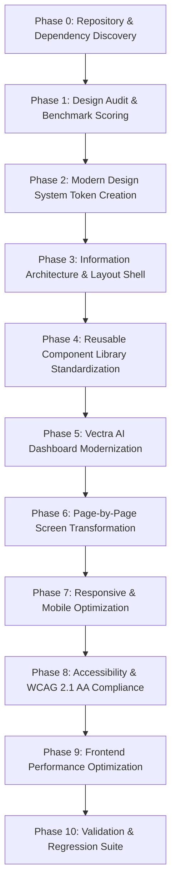

# SOC5-Outbound Enterprise Frontend Modernization Master Plan
**Design Direction:** Vectra AI Operations & Logistics Dashboard Overview  
**Version:** 1.0.0  
**Target:** Production-Grade Modern UI/UX Architecture  
**Scope:** Presentation & Modern Design System (Zero Backend / Logic Modifications)

---

## 1. Executive Summary

### 1.1 Project Mission & Context
`SOC5-Outbound` is a high-throughput, enterprise internal logistics platform designed to orchestrate outbound linehaul operations, mid-mile truck dispatching, docking confirmations, real-time KPI metrics, and operational user governance across role-based boundaries (`ops_pic`, `fte_ops`, `fte_mm`, `doc_officer`, `dock_officer`).

The primary objective of this frontend modernization project is to transform the existing user interface into a state-of-the-art, premium AI operations dashboard inspired by the **Vectra AI Dashboard Overview**. The new visual architecture introduces modern aesthetics—including curated color palettes, glassmorphism, crisp typography scales, micro-interactions, elevated telemetry cards, and refined data tables—while strictly maintaining **100% of existing backend contracts, Laravel controllers, Supabase subscriptions, Zustand store schemas, authentication flows, and business validation logic**.

### 1.2 Non-Negotiable Constraints & Scope Boundaries
* **ZERO Backend Changes**: No modifications to PHP Laravel Controllers, Services, Repositories, Migrations, or Routes.
* **ZERO API Contract Alterations**: All payload structures, query string builders, status enums, and request lifecycles remain identical.
* **ZERO State Machine Modifications**: Zustand store (`useUiStore`), Supabase Auth event handling, and React Query fetch intervals remain unmodified.
* **Pure Visual & Design System Transformation**: Scope is exclusively constrained to layout, typography, spacing, color tokens, visual hierarchy, reusable UI primitives, micro-animations, theme support, accessibility (WCAG 2.1 AA), and responsive design across desktop, laptop, tablet, and mobile displays.

---

## 2. Code Review Graph Discovery & System Architecture

### 2.1 Discovered Architecture & Codebase Map
Through initial Code Review Graph (CRG) analysis, the frontend application structure and component topology have been mapped as follows:

```
frontend/src/
├── App.tsx                     # Main Auth state resolver, login backdrops & top-level view wrapper
├── main.tsx                    # React Root, QueryClientProvider, ErrorBoundary & SCSS entry point
├── types/                      # TypeScript definitions (AppView, Role, Request, Metrics, User)
├── stores/
│   └── ui.ts                   # Zustand store (sidebarOpen, soundEnabled, search, dateFrom, dateTo, viewRole)
├── lib/
│   ├── api.ts                  # Fetch API wrapper with ApiError handling & auth token headers
│   ├── requests.ts             # Request query parameters & CSV export generator
│   └── supabase.ts             # Supabase Auth client instance & session listener
├── hooks/
│   └── useQueueNotifications.ts# Audio chime & notification polling hook for active requests
├── components/
│   ├── AppHeader.tsx           # Workspace header, global search, notification chime toggle, role switcher, user menu
│   ├── AppSidebar.tsx          # Navigation sidebar with role-restricted menu items & badges
│   ├── RequestTable.tsx        # High-density operational data table with inline actions & row expansion
│   ├── RequestFilters.tsx      # Date range pickers, status filters, search input & view toggles
│   ├── ColumnVisibilityMenu.tsx# Dropdown menu to show/hide table columns dynamically
│   ├── Modal.tsx               # Accessible modal wrapper with focus trap & keyboard trap
│   ├── Pagination.tsx          # Page navigation & rows-per-page selector
│   ├── SkeletonTable.tsx       # Loading skeleton UI for tables and metric panels
│   ├── StatusBadge.tsx         # Pill badge for request statuses (Pending, Approved, Rejected, Completed)
│   ├── PrintableTruckLabel.tsx # Printable dispatch label modal with QR code renderer
│   └── ErrorBoundary.tsx       # React error boundary component for fallback states
└── pages/
    ├── Dashboard.tsx           # Layout shell, role permission checker, dynamic lazy-loaded view router
    ├── Overview.tsx            # Logistics telemetry dashboard, trend graphs, operational alert feeds
    ├── OutboundRequests.tsx    # Outbound Linehaul request table, inline creation, bulk approvals & edit dialogs
    ├── MidmileRequests.tsx     # Mid-mile truck request table, status transitions & truck label printing
    ├── DockingConfirmation.tsx # Docking gate verification, arrival/departure timestamps & confirmation dialogs
    ├── Kpi.tsx                 # Operations KPI summary, daily efficiency breakdown & breakdown tables
    ├── UserManagement.tsx      # Operational user table, role assignment & creation modals
    ├── ChangePassword.tsx      # Mandatory password update flow for newly provisioned accounts
    └── Login.tsx               # Login page with Google OAuth & OTP backroom email authentication
```

---

## 3. Current UI Audit & Baseline Evaluation

Each area of the existing user interface has been audited against modern enterprise design benchmarks and assigned a score from 1 (Poor) to 10 (World-Class):

| UI Metric / Domain | Current Score (1-10) | Key Defects & Pain Points | Target Modernization Strategy |
| :--- | :---: | :--- | :--- |
| **Consistency & Tokens** | **4 / 10** | Ad-hoc inline CSS properties, inconsistent color values, hardcoded px gaps. | Establish unified Design System tokens (`CSS custom properties`) in SCSS. |
| **Typography Scale** | **5 / 10** | Browser default fonts or inconsistent font weights, poor heading hierarchy. | Implement Google Font **Inter / Plus Jakarta Sans** with strict scale hierarchy. |
| **Color & Theme Palette** | **4 / 10** | Basic flat colors lacking depth, contrast issues in dark theme backgrounds. | Introduce Vectra dark glassmorphism palette, vibrant accents, dark mode readiness. |
| **Visual Hierarchy & Depth** | **4 / 10** | Flat borders, flat shadows, lack of spatial elevation and backdrop blur. | Multi-layered card elevation (`box-shadow`), glassmorphic borders, soft glow effects. |
| **Telemetry & KPI Cards** | **5 / 10** | Static metric boxes without clear trend sparklines, mini charts, or status badges. | Modern telemetry cards with mini sparklines, status pills, dynamic icons, hover lift. |
| **Data Tables & Density** | **5 / 10** | Basic table borders, cramped headers, unrefined column alignment and pagination. | Enterprise dense table layout, hover highlighting, sticky headers, subtle striping. |
| **Forms & Controls** | **4 / 10** | Native inputs without custom focus states, inconsistent dropdown styling. | Floating labels/clean inputs, custom focus rings, micro-transitions, error tooltips. |
| **Modals & Dialogs** | **5 / 10** | Standard blocky modal overlays, minimal animation on mount/unmount. | Glassmorphic backdrops (`backdrop-filter: blur`), smooth scale-up pop transitions. |
| **Navigation (Header/Sidebar)**| **5 / 10** | Basic navigation list, collapse state feels rigid, unrefined role switcher. | Sleek collapsible sidebar, active tab indicators, glowing role badges, profile avatar. |
| **Loading & Empty States** | **5 / 10** | Basic skeleton bars, generic empty text when tables have 0 rows. | Shimmer-animated skeleton placeholders, rich illustrative empty state illustrations. |
| **Accessibility (WCAG)** | **5 / 10** | Missing explicit ARIA landmarks on some controls, focus rings often outline-none. | Full keyboard navigation, visible focus rings, ARIA labels, 4.5:1 contrast compliance. |
| **Responsive Flexibility** | **4 / 10** | Horizontal scrolling on smaller laptop/tablet views, overflowing filter bars. | Fluid CSS Grid / Flex layout, mobile drawer navigation, stacked filter drawers. |

---

## 4. Design Vision & Aesthetic Direction (Vectra AI Operations Theme)

The modernized visual direction draws direct inspiration from high-end AI dashboards (Vectra AI Overview):

* **Visual Theme:** Deep Slate / Dark Glassmorphism with electric cyan (`#06b6d4`), indigo (`#6366f1`), and emerald (`#10b981`) accent indicators.
* **Background & Layers:** Tiered dark surfaces (`#090d16` base layer, `#111827` surface layer, `#1f2937` card container layer) with subtle linear gradients and `backdrop-filter: blur(12px)`.
* **Typography:** `Inter` or `Plus Jakarta Sans` for UI text, combined with monospace numbers (`JetBrains Mono` or `Fira Code`) for metrics, timestamps, truck plate numbers, and request tracking IDs.
* **Micro-Interactions:** Subtle scale transitions (`transform: translateY(-2px)`), glow-on-hover card borders, animated pulse indicators for real-time pending queues, and smooth state switches.
* **Data Visualization:** Telemetry sparklines, smooth SVG curves, color-coded status badges with glowing status dots, and crisp grid alignments.

---

## 5. Master Implementation Plan (Phases 0 through 10)



### Phase 0: Repository Discovery & Dependency Analysis
* Use Code Review Graph to map all component relationships, layout containers, and hooks.
* Verify dependency chain from `App.tsx` down to individual view lazy imports.
* Ensure zero backend/logic files are touched during the modernization process.

### Phase 1: Design Audit & Baseline Metrics
* Establish quantitative baseline scores (detailed in Section 3).
* Record current UI component props, parameters, and render conditions.

### Phase 2: Design System Token Architecture (`frontend/src/styles/`)
* Refactor `frontend/src/styles/main.scss` into structured design token modules:
  * `_tokens.scss`: Color variables, dark/light theme tokens, typography scale, spacing scale, elevation shadows, border-radius, z-index layers.
  * `_typography.scss`: Headings, body styles, metric monospace text, label caps.
  * `_glass.scss`: Glassmorphism utility classes, backdrop blur effects, border gradients.
  * `_animations.scss`: Keyframes for shimmer loading, glow pulses, slide-in drawers, and modal pop animations.
  * `_utilities.scss`: Layout grid helpers, flex alignment helpers, status colors.

### Phase 3: Information Architecture & Shell Redesign
* **Modern Shell (`AppSidebar.tsx` & `AppHeader.tsx`):**
  * Elevate `AppSidebar.tsx` into a collapsible, sleek navigation dock with glowing active route pills, role-based item grouping, and badge counters for pending items.
  * Modernize `AppHeader.tsx` with a unified global search bar (`Cmd+K` aesthetic), quick sound notification chime toggle, role-switcher select menu, user status indicator, and quick logout action.

### Phase 4: Reusable Component Library Modernization
Standardize primitive UI components in `frontend/src/components/`:
* `StatusBadge.tsx`: Pill badge with glowing status dot (`pending`, `approved`, `rejected`, `completed`).
* `RequestTable.tsx`: Dense, high-contrast data table with sticky headers, subtle row hover backgrounds, quick action button group, and expandable request detail drawers.
* `RequestFilters.tsx`: Unified filter bar containing date-range inputs, search bar, status tabs, and column toggles with active filter count pill.
* `Modal.tsx` & Dialogs: Glassmorphic modal overlay with smooth entry animation, accessible focus ring, and action button bar.
* `Pagination.tsx`: Sleek pagination bar with page size dropdown and item count summary.
* `SkeletonTable.tsx`: Shimmering skeleton loader with gradient shimmer animation.
* `PrintableTruckLabel.tsx`: Clean dispatch label printable preview with QR code container.

### Phase 5: Dashboard Modernization (`Overview.tsx`)
* Transform `Overview.tsx` into an AI-powered telemetry control center based on Vectra:
  * Top KPI Grid: Outbound Volume, Pending Approvals, Dock Utilization Rate, Average Processing Time with sparkline graphs and change indicators.
  * Logistics Dispatch Flow & Activity Feed: Real-time event log with color-coded event icons.
  * Truck Docking Overview Widget: Gate status overview with active truck assignments.
  * Quick Operations Panel: One-click actions for creating requests or jump-navigating to queues.

### Phase 6: Page-by-Page View Modernization
Modernize each view independently with Code Review Graph impact verification:
1. `OutboundRequests.tsx`: Linehaul management view with bulk selection actions, inline request creation modal, filter bar, and status management.
2. `MidmileRequests.tsx`: Mid-mile request queue with truck assignment, status transitions, and label printing triggering.
3. `DockingConfirmation.tsx`: Gate docking workflow with time pickers, dock status summary, and confirmation modals.
4. `Kpi.tsx`: Detailed operations metrics, summary cards, daily breakdown tables with sortable columns.
5. `UserManagement.tsx`: User list grid, role assignment selectors, and user creation dialog.
6. `ChangePassword.tsx`: Clean, secure password change card with strength indicator and verification tips.
7. `Login.tsx`: Enterprise login portal with backdrop graphics, OAuth buttons, and backroom OTP login flow.

### Phase 7: Responsive Optimization
* **Desktop (1440px+):** Expanded sidebar, dual-column telemetry grid, full-density table views.
* **Laptop (1024px - 1439px):** Collapsible sidebar, compact table spacing, adaptive stat cards.
* **Tablet (768px - 1023px):** Off-canvas slide-out sidebar, stacked stat cards, horizontal table scrolling container.
* **Mobile (<768px):** Mobile app bar with bottom drawer menu, single-column stacked metrics, card-based mobile row representations.

### Phase 8: Accessibility & WCAG Compliance
* Keyboard navigation (`Tab`, `Shift+Tab`, `Escape`, `Enter`, `Space`) across all interactive components.
* Visible focus indicators (`outline: 2px solid var(--accent-color)`).
* Screen reader support with appropriate `aria-label`, `aria-expanded`, `aria-hidden`, and `role` attributes.
* Contrast compliance meeting WCAG 2.1 AA standard (minimum 4.5:1 for normal text).

### Phase 9: Performance Optimization
* Maintain React `lazy()` chunking for views in `Dashboard.tsx`.
* Optimize memoization on `RequestTable` and filter change handlers to eliminate unnecessary re-renders.
* Minimize CSS bundle size by consolidating duplicate style selectors into SCSS mixins and CSS variables.

### Phase 10: Validation & Verification Framework
* Post-implementation validation using Code Review Graph to guarantee zero broken imports or side effects.
* Cross-browser styling check (Chrome, Edge, Firefox, Safari).
* Verify state retention across role switching and view navigation.

---

## 6. File-by-File Execution Plan

| File Path | Component / Role | Planned Modernization & Refactoring Changes | Impact Radius |
| :--- | :--- | :--- | :--- |
| `frontend/src/styles/main.scss` | Global Design System | Rebuild SCSS with Vectra design tokens, dark glassmorphic variables, typography rules, component classes, animations. | Global |
| `frontend/src/components/AppSidebar.tsx` | Main Navigation Dock | Re-style sidebar container, add active nav item glowing indicators, collapse/expand smooth transitions, role section headers. | Low |
| `frontend/src/components/AppHeader.tsx` | Top Header Bar | Implement glassmorphism header, search input styling, notification chime button, role switcher dropdown, user avatar. | Low |
| `frontend/src/components/StatusBadge.tsx` | Status Pill Component | Enhance status colors with translucent backgrounds, glowing indicator dots, and subtle borders. | Low |
| `frontend/src/components/RequestTable.tsx` | Operational Data Table | Redesign header typography, alternating row hovers, status badges, action buttons, expandable drawer styles. | High |
| `frontend/src/components/RequestFilters.tsx` | Filter Controls Bar | Group search input, date range pickers, status tabs, and column toggles into a unified glass card filter bar. | Medium |
| `frontend/src/components/Modal.tsx` | Modal Primitive | Apply glassmorphism overlay background (`backdrop-filter`), smooth entrance animation, clean close button. | Medium |
| `frontend/src/components/Pagination.tsx` | Table Pagination Bar | Style page buttons, active page highlight, rows-per-page select input, text count legend. | Low |
| `frontend/src/components/SkeletonTable.tsx` | Shimmer Loading State | Modernize skeleton loader with animated gradient shimmer waves for tables and panels. | Low |
| `frontend/src/components/PrintableTruckLabel.tsx` | Truck Dispatch Label | Re-style printable dispatch label modal layout, high-contrast QR container, clear print layout formatting. | Low |
| `frontend/src/pages/Dashboard.tsx` | App Shell & View Router | Refine app shell grid (`.app-shell`), responsive sidebar drawer trigger, view loading fallback container. | Medium |
| `frontend/src/pages/Overview.tsx` | Logistics Telemetry View | Transform into Vectra AI Operations Dashboard: KPI cards, trend sparklines, event log stream, gate status grid. | High |
| `frontend/src/pages/OutboundRequests.tsx` | Outbound Management | Modernize table page wrapper, top action bar (Create Request, Bulk Approve), filter bar, and edit modals. | High |
| `frontend/src/pages/MidmileRequests.tsx` | Mid-mile Management | Re-style mid-mile queue view, action dialogs, dispatch label triggers, and status workflow cards. | High |
| `frontend/src/pages/DockingConfirmation.tsx` | Docking Confirmation | Redesign docking gate selection cards, timestamp entry forms, status chips, and confirmation dialogs. | Medium |
| `frontend/src/pages/Kpi.tsx` | Operational Metrics View | Enhance KPI metrics cards, daily performance trend charts, metric comparison panels, and data tables. | Medium |
| `frontend/src/pages/UserManagement.tsx` | User Administration View | Modernize user grid table, role assignment badges, create user modal, and active status toggles. | Medium |
| `frontend/src/pages/ChangePassword.tsx` | Password Update View | Refine card enclosure, password input feedback, security requirement checklist, submit actions. | Low |
| `frontend/src/pages/Login.tsx` | Authentication Portal | Elevate login screen: dark glass container, vector grid background, Google OAuth button, OTP form fields. | Medium |

---

## 7. Dependency & Risk Assessment

### 7.1 Risk Matrix
| Risk Event | Severity | Probability | Mitigation Strategy |
| :--- | :---: | :---: | :--- |
| **Accidental Logic Mutation** | High | Low | Modify ONLY JSX layout tags and CSS class assignments. Never touch API fetch logic or state handlers. |
| **Zustand Store Incompatibility** | High | Low | Keep `useUiStore` state structure identical. Access state values without mutating action names. |
| **Breakage of Table Data Props** | Medium | Low | Maintain exact component prop interfaces for `RequestTable`, `RequestFilters`, and `Pagination`. |
| **Print Layout Regression** | Medium | Low | Ensure `@media print` CSS rules in `PrintableTruckLabel.tsx` remain isolated from UI theme styles. |
| **Responsive Overflow on Mobile** | Low | Medium | Apply overflow-x hidden containers and responsive mobile drawer hooks on smaller breakpoints. |

### 7.2 Rollback Strategy
If any visual regression occurs during implementation:
1. Revert the specific component file using version control (`git checkout`).
2. Run Code Review Graph dependency check to ensure surrounding components remain intact.
3. Validate layout consistency against baseline styles.

---

## 8. Completion & Verification Checklist

- [ ] **Phase 0:** Repository graph mapped via Code Review Graph.
- [ ] **Phase 1:** UI design audit completed and benchmarked.
- [ ] **Phase 2:** Design system SCSS tokens (`_tokens.scss`, `_glass.scss`, `_animations.scss`) created.
- [ ] **Phase 3:** `AppSidebar.tsx` and `AppHeader.tsx` modernized into Vectra UI shell.
- [ ] **Phase 4:** Reusable UI components (`RequestTable`, `RequestFilters`, `Modal`, `StatusBadge`, `Pagination`, `SkeletonTable`) standardized.
- [ ] **Phase 5:** `Overview.tsx` upgraded into a modern Vectra AI telemetry dashboard.
- [ ] **Phase 6:** All pages (`OutboundRequests`, `MidmileRequests`, `DockingConfirmation`, `Kpi`, `UserManagement`, `ChangePassword`, `Login`) modernized page-by-page.
- [ ] **Phase 7:** Mobile and tablet responsive layouts optimized across all breakpoints.
- [ ] **Phase 8:** Accessibility verified for WCAG 2.1 AA keyboard navigation, contrast, and focus states.
- [ ] **Phase 9:** CSS bundle and component render performance optimized.
- [ ] **Phase 10:** Final dependency verification using Code Review Graph; 0 backend or state regressions confirmed.

---
*End of Master Plan — Ready for Phase-by-Phase Execution.*
